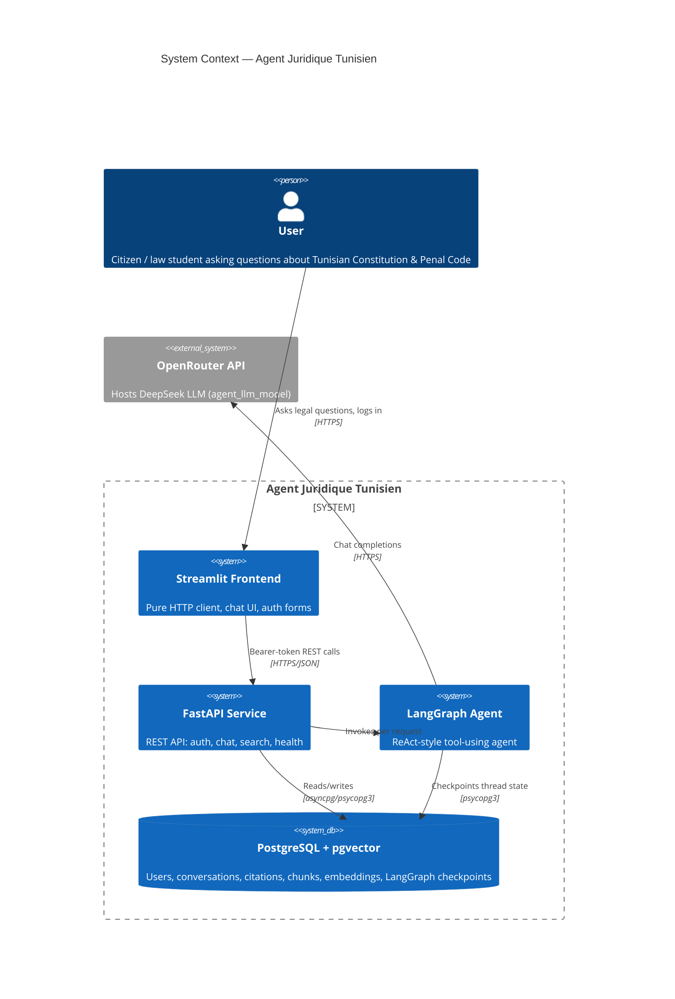
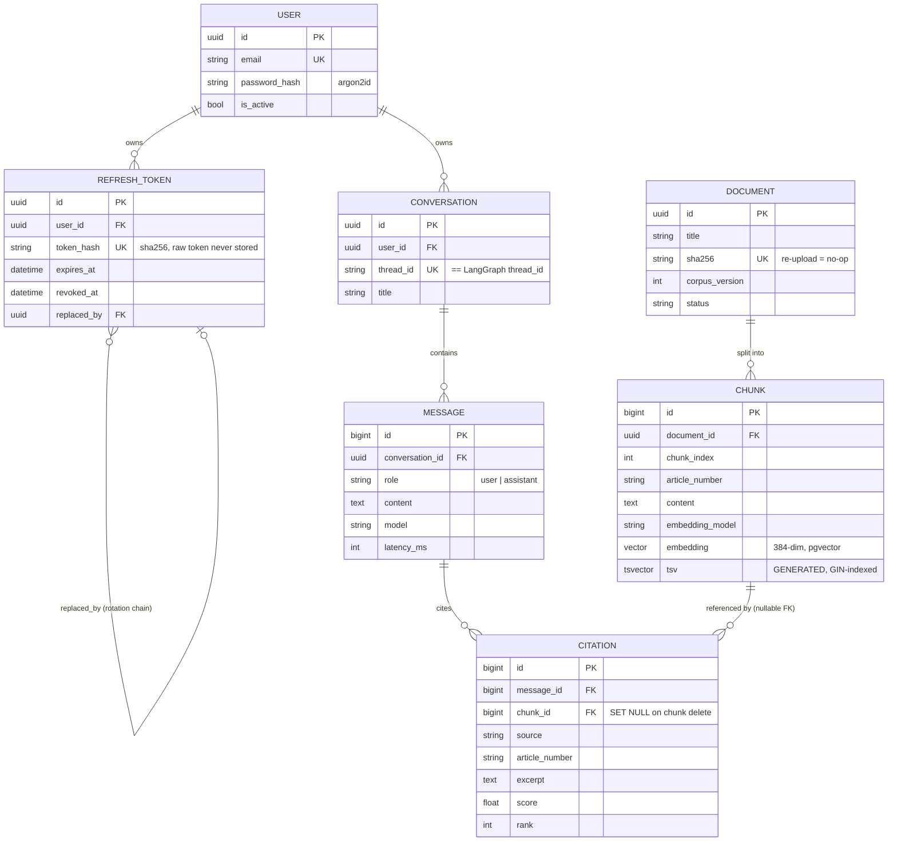
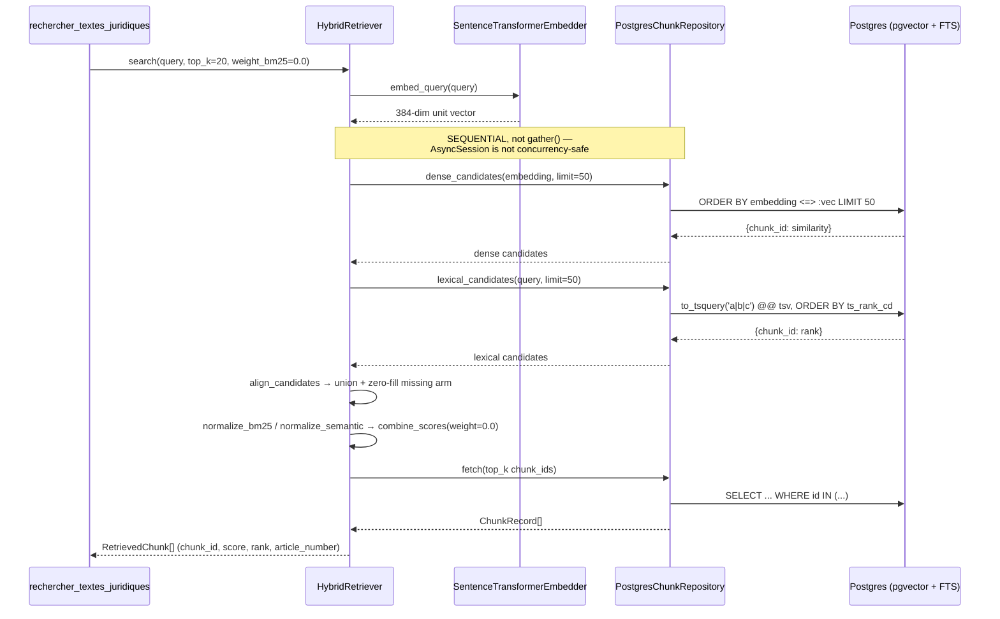
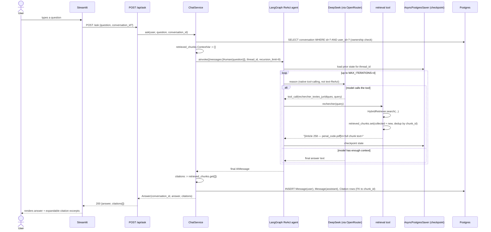
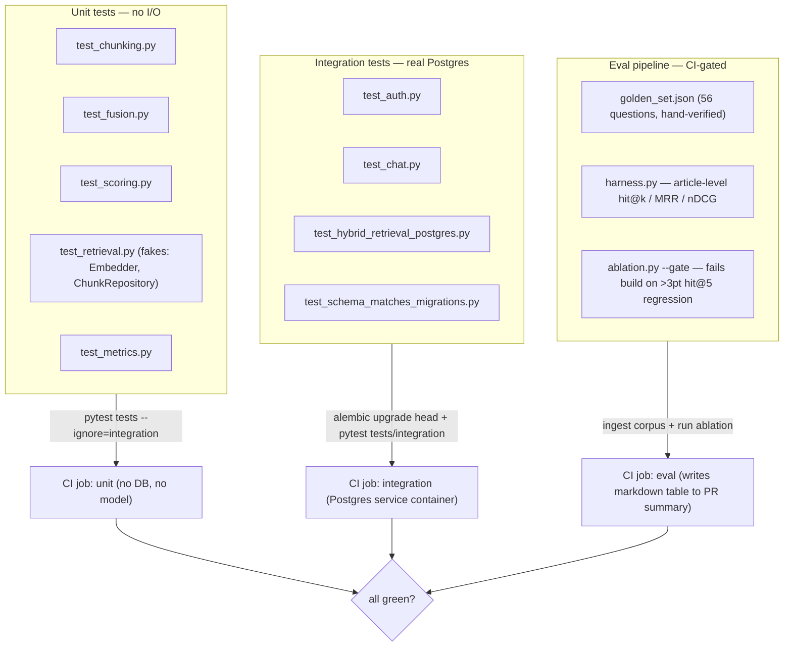
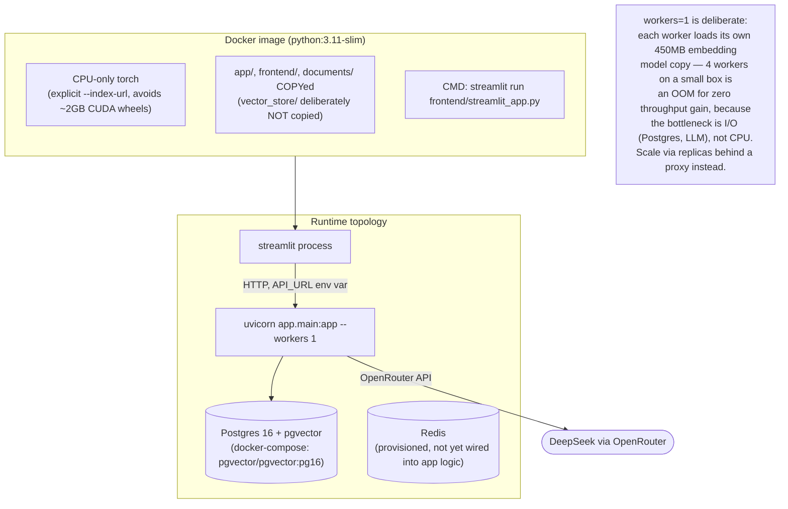

# Agent Juridique Tunisien — Architecture & Design Report

**Scope:** full-stack review of the codebase at `agentic_tn_law/Agentic_Tn_law` — a Retrieval-Augmented-Generation (RAG) legal assistant for Tunisian law (Constitution + Code Pénal), built on FastAPI, LangGraph, Postgres/pgvector, and a Streamlit client.
**Audience:** engineers evaluating the system's design, and reviewers assessing it as a portfolio piece.
**Author of this report:** generated by reading the full source tree, migrations, tests, CI pipeline, and PRD.

---

## Table of contents

1. [Executive summary](#1-executive-summary)
2. [System context](#2-system-context)
3. [Layered architecture](#3-layered-architecture)
4. [Component walkthrough](#4-component-walkthrough)
5. [Data model](#5-data-model)
6. [Retrieval architecture](#6-retrieval-architecture-the-core-ip)
7. [Agentic workflow (LangGraph)](#7-agentic-workflow-langgraph)
8. [AuthN/AuthZ architecture](#8-authnauthz-architecture)
9. [Ingestion pipeline](#9-ingestion-pipeline)
10. [Observability & error semantics](#10-observability--error-semantics)
11. [Testing & evaluation strategy](#11-testing--evaluation-strategy)
12. [Deployment architecture](#12-deployment-architecture)
13. [Engineering postmortems (the 13 bugs)](#13-engineering-postmortems-the-13-bugs)
14. [Key design decisions & trade-offs](#14-key-design-decisions--trade-offs)
15. [Product context & roadmap](#15-product-context--roadmap)
16. [Senior-engineer assessment](#16-senior-engineer-assessment)
17. [Appendix — tech stack](#17-appendix--tech-stack)

---

## 1. Executive summary

This is a **citation-grounded RAG system**, not a chatbot wrapper. The engineering is organized around one thesis that shows up everywhere in the code: *an LLM-based legal assistant is worthless — or dangerous — the moment it cannot prove where an answer came from, or fails silently instead of loudly.* Every architectural boundary in the repo defends that thesis:

- **Hexagonal domain core.** `app/domain/` (chunking, scoring, fusion, retrieval) is pure Python with zero framework imports — no LangChain, no SQLAlchemy, no FastAPI. It is tested and *measured* (via an offline ablation harness) without a database or a model download.
- **Structural citation guarantee.** A citation is a foreign-key row (`citations.chunk_id → chunks.id`), not a string the model was asked nicely to produce. The API cannot return a citation for a chunk that was never retrieved.
- **Stateless agent, stateful storage.** The LangGraph agent holds no per-user state; conversation memory lives in Postgres (`AsyncPostgresSaver`) keyed by a `thread_id` that is only reachable through an ownership check in `chat_service.py`.
- **Failure ≠ answer.** A `DomainError` hierarchy maps every failure mode (LLM timeout, empty corpus, invalid token) to a distinct HTTP status. Nothing is ever silently rendered as legal advice.
- **Evidence-driven retrieval tuning.** The hybrid BM25/dense retriever's fusion weight is not a guess — it's set to `0.0` (dense-only) because a 56-question golden-set ablation, gated in CI, measured that every hybrid weighting underperformed pure dense retrieval on this corpus.

The repository's comments read like incident postmortems (`BUG 1` … `BUG 13`), and that is deliberate: it documents *why* the architecture looks the way it does, which is the single most valuable thing a portfolio codebase can do for a reviewer.

---

## 2. System context



The system has exactly one external dependency that matters at runtime: **OpenRouter**, which fronts the DeepSeek chat model. Everything else — retrieval, auth, persistence, memory — is self-hosted. This is a deliberate cost/control decision: the corpus (Constitution + Penal Code) never leaves the system, and retrieval quality is not at the mercy of a third-party vector-search product.

---

## 3. Layered architecture

The codebase is a textbook **Ports & Adapters (Hexagonal) architecture**, enforced by import direction rather than by convention alone — `app/domain/` physically cannot import SQLAlchemy, LangChain, or FastAPI, which is what makes the domain layer testable with in-memory fakes.

```mermaid
flowchart TB
    subgraph presentation ["Presentation"]
        UI["Streamlit frontend<br/>(frontend/streamlit_app.py)"]
    end

    subgraph api ["API layer — app/api/"]
        routes["routes/ (auth, chat, search, health)"]
        schemas["schemas/ (Pydantic DTOs)"]
        deps["deps.py (DI: session, embedder, current_user)"]
    end

    subgraph services ["Application services — app/services/"]
        chatsvc["ChatService"]
        authsvc["AuthService"]
    end

    subgraph agent ["Agent — app/agent/"]
        graph["graph.py (build_agent, checkpointer)"]
        tools["tools.py (retrieval tool + ContextVar)"]
        prompts["prompts.py (SYSTEM_PROMPT)"]
    end

    subgraph domain ["Domain core — app/domain/  (pure Python, no I/O)"]
        chunking["chunking.py"]
        retrieval["retrieval.py (HybridRetriever)"]
        fusion["fusion.py (RRF, align_candidates)"]
        scoring["scoring.py (normalize, combine)"]
        ports["ports.py (Embedder, ChunkRepository, Reranker Protocols)"]
        models["models.py (Chunk, RetrievedChunk — dataclasses)"]
    end

    subgraph infra ["Infrastructure — app/infra/"]
        db["db/ (SQLAlchemy models, PostgresChunkRepository)"]
        emb["embeddings/ (SentenceTransformerEmbedder)"]
        pdf["pdf.py (PyMuPDF extraction)"]
    end

    subgraph core ["Cross-cutting — app/core/"]
        config["config.py (Settings)"]
        errors["errors.py (DomainError hierarchy)"]
        security["security.py (JWT, argon2)"]
        logging["logging.py (structlog)"]
    end

    UI -->|HTTP/JSON| routes
    routes --> deps --> services
    routes --> schemas
    services --> agent
    services --> domain
    agent --> domain
    agent -.->|via port| infra
    domain -->|Protocol only| ports
    infra -.->|implements| ports
    services --> infra
    api --> core
    services --> core
    agent --> core

    style domain fill:#1a3a1a,stroke:#4a8a4a,color:#fff
    style infra fill:#2a2a4a,stroke:#5a5a9a,color:#fff
    style core fill:#3a2a1a,stroke:#8a5a3a,color:#fff
```

The dependency rule that matters: **domain depends on `ports.Protocol`, infra implements those protocols, nothing in `domain/` imports `infra/`.** This is why `eval/ablation.py` can sweep 11 retrieval configurations against a real corpus while `tests/test_fusion.py` and `tests/test_scoring.py` exercise the exact same math with zero I/O.

---

## 4. Component walkthrough

### 4.1 `app/domain/` — the business logic, framework-free

| File | Responsibility | Why it's isolated |
|---|---|---|
| `models.py` | `Chunk`, `ChunkRecord`, `RetrievedChunk` — frozen dataclasses | No ORM leakage into ranking logic |
| `chunking.py` | Article-aware text splitting (regex on `Article \d+ (bis\|ter\|quater\|quinquies)`) | Chunking strategy is an ablation axis, tested with plain strings |
| `scoring.py` | Min-max normalization, weighted score combination, top-k selection | Pure `numpy` math, no model, no DB — testable and reviewable in isolation |
| `fusion.py` | `align_candidates` (union two candidate sets), `reciprocal_rank_fusion` | Encodes the score-alignment problem created by moving retrieval into SQL |
| `retrieval.py` | `HybridRetriever` — orchestrates dense + lexical search and fusion | Depends only on `Embedder`/`ChunkRepository` Protocols |
| `ports.py` | `Embedder`, `ChunkRepository`, `Reranker` Protocols | The seam that makes fakes possible |

**Senior-engineer note:** this layer is the single best design decision in the repo. Most RAG side-projects couple ranking logic directly to `chromadb.Client` or `SentenceTransformer`, which means the only way to test "does my fusion formula make sense" is to boot a vector DB and load a 450MB model. Here, `tests/test_fusion.py` and `tests/test_scoring.py` run in milliseconds against hand-built dicts, and the *exact same* `HybridRetriever` class is what runs in production and in the CI ablation gate — there is no test/prod drift because there is no second implementation.

### 4.2 `app/infra/` — adapters

- **`db/models.py`** — SQLAlchemy 2.0 declarative models. Kept deliberately separate from `domain/models.py` (see §3). Notable: `Chunk.tsv` is a Postgres `GENERATED ALWAYS AS ... STORED` `TSVECTOR` column (`to_tsvector('french_unaccent', content)`), so the lexical index is transactionally consistent with every `INSERT` — there is no separate index-build step to forget.
- **`db/repositories/chunk_repo.py`** — `PostgresChunkRepository`, the concrete `ChunkRepository`. Implements both retrieval arms as SQL:
  - dense arm: pgvector `<=>` cosine-distance operator, converted to similarity (`1 - distance`) before it reaches domain math — a scale mismatch here would silently invert the ranking (documented as a near-miss in the code).
  - lexical arm: `to_tsquery` built by OR-ing lexemes (`a | b | c`), ranked with `ts_rank_cd` (cover-density) — chosen over `websearch_to_tsquery`'s implicit AND semantics after the eval harness caught that AND-mode returned **zero results for every natural-language question** in the golden set (see Bug list, §13).
- **`embeddings/sentence_transformer.py`** — wraps `intfloat/multilingual-e5-small`. Adds the `"query: "` / `"passage: "` prefixes e5 requires, unit-normalizes vectors so cosine distance behaves, and offloads the blocking `.encode()` call via `asyncio.to_thread` so it doesn't stall the event loop.
- **`pdf.py`** — PyMuPDF-based text extraction from the source law PDFs.

### 4.3 `app/api/` — the HTTP boundary

- **`routes/`** — thin FastAPI routers (`auth`, `chat`, `search`, `health`) that translate between Pydantic DTOs and services. No business logic lives here.
- **`deps.py`** — the dependency-injection seam. `get_current_user` decodes the JWT and re-checks `is_active` on every request (a token can outlive a disabled account). `get_embedder` returns the *single* model instance loaded once at startup — never rebuilt per request.
- **`schemas/`** — request/response Pydantic models, decoupled from ORM models so the API contract doesn't leak database column changes to clients.

### 4.4 `app/services/` — use-case orchestration

- **`ChatService.ask()`** is the central use case: resolve conversation ownership → reset the citation `ContextVar` → invoke the agent with a hard `recursion_limit` → persist `Message` + `Citation` rows → return a DTO. It's also where `CorpusNotReady` (empty corpus) and `UpstreamLLMError` (agent/LLM failure) are raised as typed domain errors instead of leaking a raw exception or a 200 with an error string.
- **`AuthService`** — registration, login (constant-time-ish via a dummy-hash verify on unknown emails), and refresh-token rotation with replay detection (§8).

### 4.5 `app/agent/` — the LangGraph agent

- **`graph.py`** — builds a `create_react_agent` (LangGraph prebuilt) bound to one tool (`rechercher_textes_juridiques`), backed by `AsyncPostgresSaver` for checkpointed memory, with `MAX_ITERATIONS = 4` as a hard cost/latency ceiling.
- **`tools.py`** — the retrieval tool. Returns a **prose string** to the model (LangChain tools must return strings) while smuggling the *structured* `RetrievedChunk` objects out through a `ContextVar`, read by `ChatService` after the run. This is the structural fix for Bug 4 (see §13) and is a genuinely elegant pattern: it avoids both (a) parsing citations back out of LLM prose, and (b) a process-global that would leak between concurrent requests, because `ContextVar` is asyncio-task-isolated.
- **`prompts.py`** — a short, rule-based French system prompt: search before answering, cite article numbers, refuse out-of-scope questions, never invent an article.

### 4.6 `frontend/streamlit_app.py`

A pure HTTP client — it imports nothing from `app/`, which the file's own docstring calls out as "a fact, not a claim": if the domain leaked into the UI, the file could not compile. It handles login/register, conversation history, and renders citations as expandable excerpts next to their score.

---

## 5. Data model



**Two things worth a reviewer's attention:**

1. **Deliberate duplication between `conversations`/`messages` and the LangGraph checkpointer.** The checkpointer (`AsyncPostgresSaver`) owns an opaque, versioned blob whose only job is *resuming agent execution* — it is explicitly excluded from Alembic's autogenerate (`alembic/env.py`'s `include_object` filter) because a naive migration diff would otherwise **drop every checkpoint table**. The `conversations`/`messages`/`citations` tables are the product's queryable read model (list conversations, show history, count citations per article). Coupling the UI's "list my chats" feature to LangGraph's internal serialization format would be one library upgrade away from breaking — so the duplication is intentional, not an oversight.

2. **Ownership is enforced at the SQL layer, not trusted to the agent framework.** LangGraph will load *any* `thread_id` it's handed — it has no user concept. `chat_service._conversation_for()` filters `WHERE id = :cid AND user_id = :uid` and returns an indistinguishable 404 whether the conversation doesn't exist or belongs to someone else (so the endpoint can't be used to enumerate valid conversation IDs).

---

## 6. Retrieval architecture (the core IP)



### 6.1 Why dense-only, measured not assumed

`hybrid_weight_bm25 = 0.0` in `config.py` is a **measured default**, not a stylistic choice. The retrieval eval harness (`eval/harness.py` + `eval/ablation.py`) sweeps 11 configurations against a 56-question golden set and gates CI on regression (`MAX_REGRESSION = 0.03` hit@5, tolerant of single-question flips in a 56-item set):

| Configuration | hit@1 | hit@5 | MRR | nDCG@10 |
|---|---|---|---|---|
| **dense only (w=0.0)** | **0.679** | **0.839** | **0.747** | **0.778** |
| RRF (rank fusion) | 0.393 | 0.750 | 0.543 | 0.611 |
| weighted w=0.4, cand=20 | 0.393 | 0.750 | 0.549 | 0.632 |
| weighted w=0.4 (cand=50, default candidate pool) | 0.304 | 0.679 | 0.462 | 0.536 |
| lexical only (w=1.0) | 0.179 | 0.357 | 0.265 | 0.332 |

The team's hypothesis going in was that the lexical arm would earn its keep on article-number lookups ("*que dit l'article 258 ?*"). They tested that class specifically: dense retrieval got 5/6, lexical got 1/6. Hypothesis rejected, on this corpus and this encoder — and the code says explicitly this is *not* assumed to generalize; the lexical arm and RRF stay wired into the ablation harness so a future corpus swap can re-measure rather than re-assume.

### 6.2 Two failure modes this pipeline was built to survive

1. **Truncation bias in score fusion** (`fusion.py`): a chunk absent from one arm's top-N is scored `0.0` for that arm — not "low but positive." `reciprocal_rank_fusion` exists specifically because it never compares raw scores across arms, sidestepping the bias (at the cost of losing the score-scale meaning).
2. **A cosine-distance/similarity sign flip**: pgvector's `<=>` operator returns *distance* (0 = identical), but the domain layer's `normalize_semantic` expects *similarity* (1 = identical). Handing the raw distance through would rank results **backwards** while still returning plausible French legal text — a bug that produces confident, wrong output with no error, no warning, no crash. This is called out explicitly in `chunk_repo.py` as "the trap."

### 6.3 Chunking is article-aware, not fixed-size

`domain/chunking.py` splits on `^Article \d+ (bis|ter|quater|quinquies)?` boundaries first, falling back to structural size-splitting (`\n\n` → `\n` → `. ` → ` `) only *inside* an over-long article, and only after ignoring separator matches in the first quarter of the window (to avoid runt chunks). Rationale stated in the docstring: a chunk that straddles two articles cannot be attributed to either one, and the eval harness's `expected_article` label is otherwise uncomputable.

---

## 7. Agentic workflow (LangGraph)



Key properties:

- **Native tool-calling, not text-ReAct.** The old design used a `Pensée: / Action: / Observation:` prompt template the model had to imitate verbatim, with `handle_parsing_errors=True` papering over failures. LangGraph's `create_react_agent` uses the model's structured tool-calling API, so there is no format to mis-imitate and no parse-error class to handle.
- **A hard iteration ceiling (`MAX_ITERATIONS = 4`).** The prior executor allowed 10 — worst case, ten LLM round-trips and ten corpus searches for one question. Four is calibrated to "search → read → maybe re-search → answer."
- **Full, untruncated article text goes to the model.** The tool used to truncate to 1000 characters; the current version reasons that handing the model half an article invites it to complete the other half from memory — "exactly how a plausible fake article number gets invented."
- **The retrieval tool is deduplicated across turns within one request** (`seen = {c.chunk_id for c in collected}`), so a multi-hop question that searches twice doesn't cite the same article twice.

---

## 8. AuthN/AuthZ architecture

```mermaid
sequenceDiagram
    participant C as Client
    participant Auth as AuthService
    participant DB as Postgres

    rect rgb(30,40,30)
    Note over C,DB: Login
    C->>Auth: authenticate(email, password)
    alt user not found
        Auth->>Auth: verify_password(pwd, DUMMY_HASH)  %% constant-time-shaped, anti-enumeration
        Auth-->>C: 401 InvalidCredentials
    else user found
        Auth->>Auth: argon2id verify
        opt hash uses old parameters
            Auth->>DB: rehash & store (only moment plaintext is held)
        end
        Auth->>DB: INSERT RefreshToken(hash=sha256(raw))
        Auth-->>C: {access_token (JWT, 15m), refresh_token (opaque, 14d)}
    end
    end

    rect rgb(40,30,20)
    Note over C,DB: Refresh rotation + replay detection
    C->>Auth: rotate(raw_refresh_token)
    Auth->>DB: SELECT WHERE token_hash = sha256(raw)
    alt token already revoked
        Auth->>DB: revoke ENTIRE token chain for user
        Auth->>DB: COMMIT (before raising!)
        Auth-->>C: 401 TokenReplayDetected — must re-auth
    else token valid & unexpired
        Auth->>DB: INSERT successor RefreshToken
        Auth->>DB: UPDATE old token: revoked_at, replaced_by=successor.id
        Auth-->>C: new {access_token, refresh_token}
    end
    end
```



Notable, defensible choices:

- **Argon2id over bcrypt/passlib.** Memory-hard, GPU-resistant; `passlib` is effectively unmaintained and warns on Python 3.13.
- **Refresh tokens are opaque random strings, not JWTs** — a JWT can't be revoked without server-side state anyway, so the state (a DB row) is the point, and a signed token would be pure ceremony. Only the **hash** is stored: a leaked token table is not a leaked set of live sessions.
- **Rotation chain enables replay detection.** An already-revoked token being presented again means either a client retry or a stolen token being reused after legitimate rotation — the two are indistinguishable, so the code assumes the worse case and revokes the user's *entire* chain.
- **The revocation commits before the 401 is raised.** The request-scoped session rolls back on any exception (including `HTTPException`); without an explicit early `commit()`, the very revocation that makes the security response meaningful would be undone by the rollback that accompanies it. This is a subtle, correctly-reasoned-through bug class.
- **A hard-coded, self-describing insecure default JWT secret** (`"dev-...-INSECURE-DEFAULT-do-not-deploy"`) makes local dev and CI work out of the box, while `main.py`'s lifespan **refuses to start** if that default is detected in `environment == "production"`.
- **User-enumeration resistance**: unknown-email and wrong-password paths both run through `verify_password`, and `ConversationNotFound` collapses "doesn't exist" and "belongs to someone else" into the same 404.

---

## 9. Ingestion pipeline

```mermaid
flowchart LR
    PDF["documents/*.pdf<br/>(Constitution, Code Pénal)"] -->|PyMuPDF| Extract["extract_text()"]
    Extract --> Hash["sha256(bytes)<br/>dedup key"]
    Hash --> Split["split_by_article()<br/>regex on Article N (bis/ter/quater)"]
    Split --> LongCheck{"article > max_chars?"}
    LongCheck -->|yes| StructSplit["structural split<br/>(¶ → line → sentence → word)"]
    LongCheck -->|no| Chunk1["one Chunk"]
    StructSplit --> ChunkN["Chunk[] with shared article_number,<br/>part_index"]
    Chunk1 --> Embed
    ChunkN --> Embed["embedder.embed_documents()<br/>e5 'passage: ' prefix, batch, to_thread"]
    Embed --> Persist["INSERT Chunk rows<br/>(embedding vector + GENERATED tsvector)"]
    Persist --> PG[("Postgres<br/>pgvector + FTS, GIN index")]

    style PG fill:#1a2a3a,stroke:#3a6a9a,color:#fff
```



Run via `python -m app.cli ingest`. Idempotent on content: re-ingesting an unchanged file is a no-op via the `sha256` unique constraint; re-ingesting a *changed* file deletes and replaces that document's chunks (cascade) and bumps `corpus_version`. A companion `python -m app.cli search <query>` command exists specifically to prove retrieval works from a **cold process that built nothing in memory** — a direct regression test for Bug 1 (§13).

---

## 10. Observability & error semantics

- **Structured logging** (`structlog`) replaces ad-hoc `print()` calls. Every log line is JSON-renderable and carries a `request_id` threaded through a `ContextVar`, bound once per HTTP request in FastAPI middleware (`bind_request_id`) — this is what makes concurrent-request logs greppable instead of interleaved noise.
- **`DomainError` hierarchy** (`core/errors.py`) is the single seam between business failures and HTTP semantics. The domain layer never imports `fastapi`, so the same exceptions could back a CLI or worker, not just a web handler.

| Exception | HTTP | Why this code specifically |
|---|---|---|
| `InvalidCredentials` | 401 | Never says which of email/password was wrong |
| `AccountDisabled` | 403 | |
| `TokenReplayDetected` | 401 | Distinct from `InvalidRefreshToken` for log/alert triage |
| `ConversationNotFound` | 404 | Same code for "missing" and "not yours" |
| `CorpusNotReady` | 503 | Service is healthy, corpus isn't indexed — a load balancer should retry, not page |
| `UpstreamLLMError` | 502 | The failure is in a dependency, not this service — keeps "our bug vs. their outage" answerable from metrics |

- **Health check reports readiness, not just liveness** (`GET /api/health`): it queries `SELECT 1` and counts indexed chunks, returning `"degraded"` if the corpus is empty even though the process is otherwise fine. A container that's "up" but has no corpus is useless, and a shallow liveness probe would happily route traffic to it.

---

## 11. Testing & evaluation strategy



Three deliberate layers, each answering a different question:

1. **Unit tests** answer "is the ranking math correct?" — run against in-memory fakes implementing the domain `Protocol`s, so they need no model download, no database, no network, and run in CI in seconds.
2. **Integration tests** answer "does this actually work against real Postgres?" — including `test_schema_matches_migrations.py`, a drift check between the SQLAlchemy ORM metadata and the Alembic migration history (the exact class of bug that let a `BigInteger` vs `Integer` mismatch previously slip through — see Bug list).
3. **The eval harness** answers "is retrieval *good*, and did this change make it worse?" — using pure-arithmetic ranking metrics (hit@k, MRR, nDCG) rather than an LLM-as-judge, explicitly because an LLM judge is nondeterministic, costs money per run, and *cannot gate a CI build on a number that wobbles*. The gate tolerance (`MAX_REGRESSION = 0.03`) is itself reasoned about: zero-tolerance would fail on the noise of a single question flipping in a 56-item set and get disabled within a week.

A secret-scanning job (`gitleaks`, full git history) runs on every push/PR, independent of the test jobs.

---

## 12. Deployment architecture



- **Startup is fail-fast and load-once**: the FastAPI `lifespan` loads the 450MB embedding model and opens the LangGraph checkpointer pool *before* the app reports ready — so the container's readiness probe genuinely means "can serve," not "process exists," and no request pays a cold-load penalty.
- **CI has three independent gates** (secrets, unit+integration, eval) that must all pass, run as separate GitHub Actions jobs with proper Postgres service-container healthchecks (`pg_isready`, not just "container started").
- Redis is provisioned in `docker-compose.yml` but not yet load-bearing in application code — likely reserved for future rate-limiting or caching (see roadmap, §15).

---

## 13. Engineering postmortems (the 13 bugs)

The single most distinctive trait of this codebase: **every non-trivial design decision is anchored to a numbered, named bug with its failure mode spelled out in the docstring at the point of the fix.** This is effectively a blameless-postmortem culture compressed into code comments, and it's what lets a reader trust that the architecture isn't cargo-culted.

| # | Symptom | Root cause | Structural fix |
|---|---|---|---|
| **1** | Retrieval silently degraded to dense-only after a process restart | In-memory BM25 index + embedding matrix were never persisted; a cold process set `is_initialized=True` without rebuilding them | Both retrieval arms moved into durable Postgres storage (pgvector + generated `tsvector`) — there is no in-memory index left to lose |
| **2** | Every visitor shared one conversation history | `ConversationBufferWindowMemory` was an attribute on an agent object cached process-wide via `@st.cache_resource` — conversation state was a property of the *process*, not the user | Agent made fully stateless; memory lives in Postgres via `AsyncPostgresSaver`, keyed by `thread_id`, with ownership enforced by a `WHERE user_id = :uid` check in the service layer |
| **3** | An upstream LLM timeout was rendered to the user as a confident legal answer, with `200 OK` | `run()` caught `Exception` and returned `str(e)` as the assistant's message | `DomainError` → `UpstreamLLMError` → mapped to `502`; a failure can never be serialized as an answer |
| **4** | Citations (`sources`) were a hardcoded placeholder string | A LangChain tool must return a `str`; the old tool flattened structured results into truncated prose and threw the objects away | A `ContextVar` gives retrieved chunks a second, structured exit path read by the service after the agent run; `citations.chunk_id` is a real foreign key, so a citation cannot exist for a chunk that wasn't retrieved |
| **5** | Double memory usage for embeddings | Two model instances loaded: one `SentenceTransformer` for manual cosine similarity, one `HuggingFaceEmbeddings` solely to satisfy Chroma's interface | Chroma removed; one embedder, one model in memory |
| **6** | (Implicit with #1) A lock could be forgotten around in-memory index mutation | Same root cause as #1 — an in-memory index needs synchronization | Dissolved by having no in-memory corpus state at all |
| **13** | 38% of Penal Code chunks were silently truncated before embedding; 12% of corpus tokens never reached the encoder | Default encoder (`paraphrase-multilingual-MiniLM-L12-v2`) has `max_seq_length=128` **tokens**, while `chunk_size` was tuned in **characters** (700 ≈ 200–250 French tokens) — no error, no warning, just silent truncation | Swapped to `intfloat/multilingual-e5-small` (512 tokens, same 384 dims, no schema migration needed); measured impact: hit@1 **0.250 → 0.679**, hit@5 **0.500 → 0.839**, MRR **0.364 → 0.747** |
| *(unnumbered)* | Hybrid search returned **zero results for every natural-language question** | `websearch_to_tsquery` ANDs unquoted terms — a 5-word French question compiles to a conjunction of 5 stems that must all appear in one chunk, which almost never happens across 716 chunks | Query built as OR'd lexemes (`a \| b \| c`) via `to_tsvector` → `to_tsquery`, ranked with `ts_rank_cd` for proximity — AND-semantics is right for a keyword search box, wrong for natural-language questions |
| *(unnumbered)* | `alembic revision --autogenerate` would have dropped every LangGraph checkpoint table | LangGraph creates its own tables outside SQLAlchemy's metadata; autogenerate's default diff doesn't know that | `include_object` filter in `alembic/env.py` explicitly excludes the six LangGraph table names from migration diffing |
| *(unnumbered)* | ORM/migration schema drift missed by a hand-rolled check | A hand-written drift test compared nullability and defaults but not column **types** — `Chunk.id` was `Mapped[int]` (→ `INTEGER`) while the migration declared `BIGINT` | Explicit `BigInteger` typing; `alembic check` / `test_schema_matches_migrations.py` catch class-level drift, not just constraint-level |
| *(unnumbered)* | A refresh-token replay would be detected, logged, and then silently undone | The request-scoped session rolls back on any raised exception, including the `HTTPException` used to report the replay — so the revocation that made the 401 meaningful would itself be rolled back | Explicit `await self._session.commit()` **before** raising `TokenReplayDetected` |

Reading this table top to bottom is effectively reading a condensed changelog of the system maturing from "works on my machine" to "survives concurrent users, cold restarts, and a hostile client." That progression is the real portfolio artifact here — more so than any single diagram.

---

## 14. Key design decisions & trade-offs

| Decision | Alternative considered | Why this one won |
|---|---|---|
| psycopg3 for both SQLAlchemy and LangGraph | asyncpg (faster raw throughput) | LangGraph's Postgres checkpointer is built on psycopg3; running two async drivers against one DB means two pools and two connection-semantics to reason about, for a throughput edge that's irrelevant at this corpus scale |
| Sequential dense/lexical retrieval calls | `asyncio.gather()` for "free" parallelism | `AsyncSession` is not safe for concurrent use — two coroutines racing to provision a connection on a not-yet-opened session raise `InvalidRequestError`, intermittently, only on the first query of a fresh request. Concurrency would require one session per arm, dragging transaction semantics into the domain layer to save milliseconds |
| No HNSW vector index (exact scan) | Add an ANN index preemptively | ~5k chunks × 384 float4 ≈ 7.5MB; an exact scan is a few ms with 100% recall. The code explicitly defers the index to "once a benchmark shows the crossover" — measured, not anticipatory |
| `uvicorn --workers 1` | `--workers 4` for "more throughput" | Each worker loads its own 450MB embedding model copy; on a small box that's an instant OOM, and on a bigger one it's 4x memory for zero gain because the bottleneck is I/O (Postgres, LLM), not CPU. Scale via replicas instead |
| Article-aware chunking over fixed-size | LangChain's `RecursiveCharacterTextSplitter` | Fixed-size splitting cuts through article boundaries, which breaks citation attribution and makes the eval harness's `expected_article` label uncomputable |
| Pure-arithmetic eval metrics | LLM-as-judge | Nondeterministic (same run scores differently), costs money per execution, and cannot gate a CI build on a number that wobbles |
| Dense-only retrieval (`weight_bm25=0.0`) | Hybrid, "because hybrid is the textbook answer" | Measured worse on every weight from 0.0 to 1.0 on this corpus/encoder; shipping "hybrid" anyway would be "choosing a worse system for a nicer word" (the code's own words) |
| Opaque refresh tokens (hashed, DB-revocable) | Long-lived JWT refresh tokens | A JWT can't be revoked without server state anyway, so the state is the point — an opaque token backed by a DB row gets you rotation and replay detection for free |

---

## 15. Product context & roadmap

The `docs/PRD.md` reveals this RAG system is the **shared platform layer** for a two-sided product bet (see `docs/PRD.md` for full detail, dated 2026-07-14):

- **"Prep"** (B2C): an AI correction engine for Tunisian bar-exam (ISPA) candidates, grading dissertations/cas pratiques against real exam rubrics.
- **"Counsel"** (B2B): citation-grounded jurisprudence search for young lawyers.

Both are explicitly designed to sit on top of *this* corpus/retrieval/agent stack, extended rather than replaced:

- `documents` grows from two PDFs into typed entities (`article` with amendment tracking, `ruling`, `exam_subject`, `rubric`).
- A new `app/services/correction_service.py` would reuse the eval-harness pattern (each rubric criterion becomes a gated regression test, exactly like `hit@5` today).
- Multi-tenancy via a `product` claim in the JWT — the auth architecture in §8 already has the shape (stateful, revocable tokens) to support this without a redesign.
- The Arabic pipeline is flagged as needing hardening: the current BM25 arm has no Arabic normalization (hamza/ta marbuta), and the embedding model needs Arabic-specific evaluation — a direct extension of the exact ablation methodology already built for French.

This context matters for evaluating the architecture: the hexagonal domain boundary, the typed `DomainError` hierarchy, and the measured-not-assumed retrieval tuning are not academic exercises — they are precisely the properties that make "add a second corpus type and a second product surface without rewriting retrieval" a plausible six-week task rather than a rewrite.

---

## 16. Senior-engineer assessment

### Strengths

- **The domain/infra boundary is real, not aspirational.** It's enforced by what can and cannot be imported, and it's exercised by two genuinely different test suites (unit fakes vs. integration Postgres) plus an offline ablation sweep — a rare thing to see fully followed through in a solo/portfolio project.
- **Every retrieval and infra tuning decision is backed by a number**, not intuition — the ablation table in §6.1 is the kind of artifact that separates "I used RAG" from "I understand what my RAG pipeline is actually doing and why."
- **Failure semantics are taken as seriously as success semantics.** The `DomainError` → HTTP status mapping, the commit-before-raise fix in token replay, and the citation-as-foreign-key pattern all show the same instinct: *make the wrong outcome structurally impossible, don't just document that it shouldn't happen.*
- **Security fundamentals are correct and reasoned, not cargo-culted**: argon2id with rehash-on-login, opaque revocable refresh tokens with replay-triggered chain revocation, timing-attack-resistant login, and a startup check that refuses to run the insecure default secret in production.

### Gaps / risks worth flagging

- **Single external dependency, no fallback.** If OpenRouter/DeepSeek is down or rate-limited, every `/ask` call fails with `UpstreamLLMError` — there's no secondary model or circuit breaker. Given `agent_max_iterations`/`llm_max_retries` exist in config, a retry-with-backoff or model-fallback story would be a natural next increment.
- **No reranker in production**, despite a `Reranker` Protocol already defined in `domain/ports.py` — it's speculative/unused. Either wire it in (cross-encoder rerank stage after fusion) or note it as intentionally deferred; right now it reads as a half-finished seam.
- **Golden set size (56 questions) is small** for the CI regression gate's stated tolerance reasoning to feel fully robust — the code itself is honest about this ("a single question flipping moves hit@5 by 1.8 points"), which is good, but it also means the gate has limited power to catch a real but small regression. Growing the golden set is flagged nowhere as planned work.
- **Redis is provisioned but structurally unused** — it's in `docker-compose.yml` with a healthcheck but no application code references it. Either it's for a near-term rate-limiting feature (plausible given the PRD's multi-tenant/entitlement plans) or it's dead infrastructure; worth resolving one way or the other before it becomes unexplained drift.
- **No rate limiting / abuse protection** on `/ask` — an authenticated user can drive unbounded LLM spend (bounded only by `MAX_ITERATIONS` per call, not by calls per minute). Given the PRD's freemium plan explicitly needs "N msgs/day" gating, this is likely known and just not yet built.
- **Arabic support is aspirational, not implemented** — the entire corpus, chunking regex (`Article \d+ bis/ter/...`), and FTS config (`french_unaccent`) are French-only. The PRD's pivot to Arabic legal text (student rubrics, code articles) will require real work on chunking, embedding evaluation, and lexical normalization — not a config flag.

### Bottom line

This is a well-architected, evidence-driven RAG system whose engineering discipline (hexagonal boundaries, typed errors, measured tuning, replay-safe auth) exceeds what the project's current scope (two PDFs, one LLM) strictly requires — which is exactly the point of a portfolio piece, and exactly what makes it a credible foundation for the two-product platform described in the PRD.

---

## 17. Appendix — tech stack

| Layer | Technology | Notes |
|---|---|---|
| API framework | FastAPI + Uvicorn | Single worker by design (§12) |
| Agent framework | LangGraph (`create_react_agent`) + `langchain-openai` | Native tool-calling; plain `langchain`/`langchain-community` dropped |
| LLM | DeepSeek (`deepseek/deepseek-chat`) via OpenRouter | Swappable via `agent_llm_model` setting |
| Embeddings | `intfloat/multilingual-e5-small` (384-dim, 512 tokens) via `sentence-transformers` | CPU-only torch in Docker |
| Vector store | PostgreSQL 16 + `pgvector` | Exact cosine search, no ANN index yet (measured decision) |
| Lexical search | PostgreSQL full-text search (`tsvector`, `french_unaccent` config, GIN index) | Generated column, transactionally consistent |
| ORM / migrations | SQLAlchemy 2.0 (async) + Alembic | `include_object` filter protects LangGraph's own tables |
| Conversation memory | `langgraph-checkpoint-postgres` (`AsyncPostgresSaver`) | Separate from the product read model by design |
| Auth | PyJWT (access tokens) + argon2-cffi (`argon2id`) + opaque SHA-256-hashed refresh tokens | Rotation chain with replay detection |
| Logging | `structlog`, JSON in prod, request-ID correlated | Replaces ~35 scattered `print()` calls |
| Frontend | Streamlit | Pure HTTP client, no shared imports with backend |
| Testing | `pytest`, `pytest-asyncio` | Unit (fakes) vs. integration (real Postgres) split |
| Evaluation | Custom harness — hit@k / MRR / nDCG, no LLM judge | CI-gated regression check vs. `eval/baseline.json` |
| CI/CD | GitHub Actions — secrets scan (gitleaks), unit+lint, integration, eval/ablation | Three independent, parallel gating jobs |
| Containerization | Docker (`python:3.11-slim`), Docker Compose (Postgres + Redis) | CPU-only torch install to avoid ~2GB of unused CUDA wheels |
| Deployment target | Render (per `app_referer` config) | — |

---

*This report was generated by reading the full source tree — `app/`, `eval/`, `tests/`, `alembic/`, `docs/PRD.md`, `docker-compose.yml`, `.github/workflows/ci.yml` — as of the current repository state. Line-level references are omitted in favor of file-level citations since this is an architecture overview, not a code-review; consult the referenced files directly for exact line numbers.*
