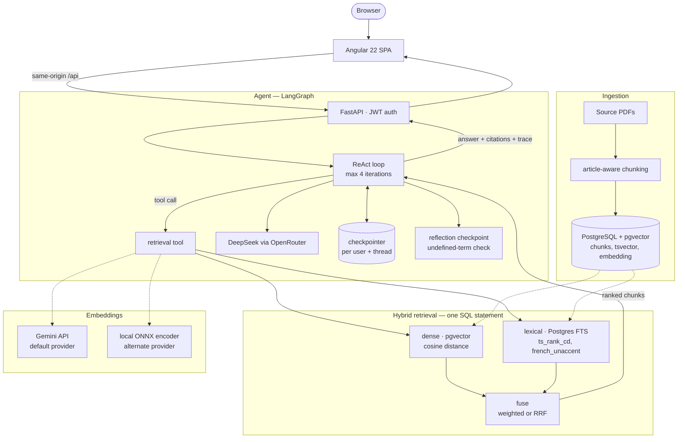
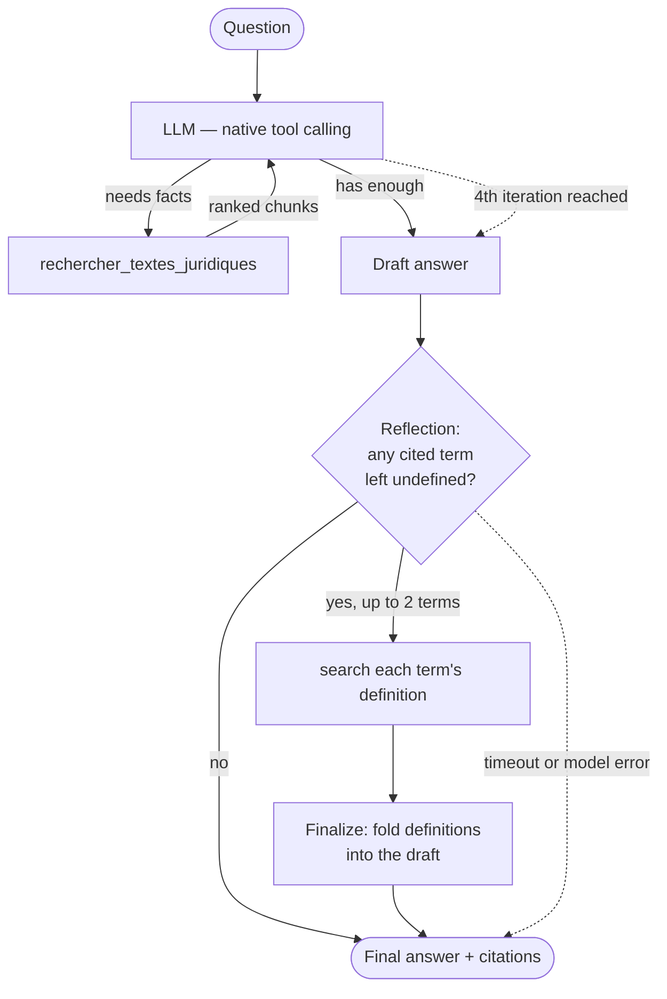
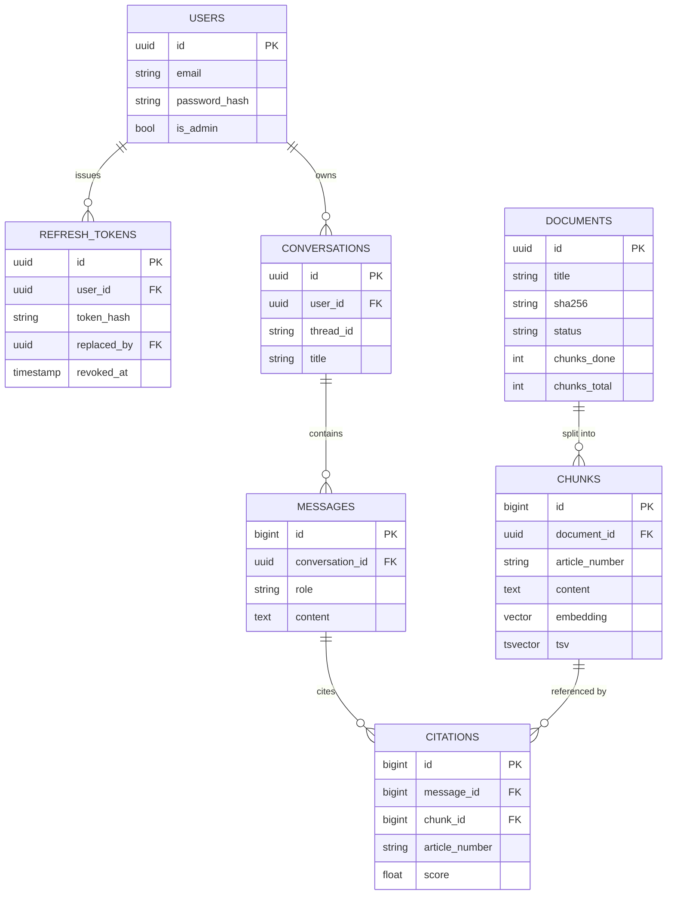

<!-- The block above is Hugging Face Spaces configuration, not documentation. Spaces reads
     it from this file to know how to build and expose the container: `sdk: docker` selects
     the root Dockerfile, and `app_port` must match the port app/run.py binds (8000 by
     default). GitHub renders it as a table; Spaces would fail to start without it. -->

# Agent Juridique Tunisien

## Abstract

Agent Juridique Tunisien is a retrieval-augmented legal assistant for Tunisian law. It
answers questions in French or English against three indexed source texts — the
Constitution, the Penal Code, and the decree-law on press freedom — and grounds every
answer in specific, cited articles rather than the model's own training data. The system
is built as a small production service rather than a notebook: typed configuration, a
migrated relational schema, an authenticated multi-tenant API, a retrieval pipeline
measured against a hand-built golden set, and a CI pipeline that gates deploys on that
measurement rather than on vibes.

The rest of this document covers the architecture, the retrieval mechanism, the agent's
reasoning loop, the data model, how answers are evaluated, and the deployment constraints
that shaped several of the decisions below.

## Architecture



Two deployment shapes exist for the same code. The default is two Render web
services — an nginx-served Angular bundle proxying `/api` to a separate FastAPI
container — because separating them decouples the UI's release cycle from the API's and
lets nginx serve static files more efficiently than uvicorn would. The API service can
also serve the built SPA itself from the same process (`STATIC_DIR` in
`app/core/config.py`), which is what makes a single-container deployment possible on a
host that only runs one process — the frontend's API client already calls a relative
`/api`, so it does not know or care which topology is serving it.

## Retrieval-augmented generation

**Chunking.** Legal text is split on article boundaries
(`app/domain/chunking.py`), not by a fixed character count. A fixed-size splitter cuts
through the middle of articles, which makes a citation meaningless — "according to
article 258" has to point at the whole article, not a fragment of it. Text before the
first article (a preamble, a table of contents) is kept but is not citable as an article.

**Embedding.** Each chunk is embedded once at ingestion time and again, identically, for
every query at answer time. The default provider is Google's Gemini embedding API,
truncated to 768 dimensions via Matryoshka representation learning; an alternative local
ONNX encoder (`intfloat/multilingual-e5-small`) is also implemented and selectable via
`EMBEDDING_PROVIDER=onnx`. Both satisfy the same `Embedder` protocol
(`app/domain/ports.py`), so retrieval logic does not know or care which one produced the
vectors it is comparing. Query and passage text are embedded with different task framing
(Gemini's `RETRIEVAL_QUERY` / `RETRIEVAL_DOCUMENT`, or e5's `query: ` / `passage: `
prefixes) — the same text embeds differently depending on which side of the search it is
on, and treating them identically measurably degrades retrieval quality.

**Hybrid retrieval.** Every search runs two arms and fuses their results
(`app/domain/retrieval.py`, `app/domain/fusion.py`):

- **Dense** — cosine distance between the query embedding and every chunk's stored
  embedding, via pgvector.
- **Lexical** — Postgres full-text search (`ts_rank_cd` against a `french_unaccent`
  text-search configuration), not an in-memory index. A BM25 index held in process memory
  is invisible to a second worker and gone on restart; a `tsvector` column generated by
  Postgres itself is durable, transactional, and consistent with every write.

The two candidate sets are combined either by weighted score or by reciprocal rank fusion,
selectable per query. Measured against the golden set, dense retrieval alone outperforms
every hybrid weighting on this corpus — see [Evaluation](#evaluation) — so
`HYBRID_WEIGHT_BM25=0.0` is the shipped default. The lexical arm and RRF remain fully
implemented and part of the ablation sweep, because that result is a property of this
specific corpus and query mix, not a law of retrieval, and needs to be re-measured rather
than assumed if either changes.

## Agent topology



The reasoning loop is a LangGraph `create_react_agent`: native tool-calling, not a
text-parsed ReAct template, so there is no output format for the model to imitate
incorrectly and nothing to catch a parse error for — malformed tool calls simply do not
happen. It has exactly one tool, `rechercher_textes_juridiques`, and a hard cap of four
iterations (`MAX_ITERATIONS` in `app/agent/graph.py`); a runaway agent doing ten searches
for one question is the single largest latency and cost sink an unbounded loop can
produce. Conversation memory is a Postgres-backed checkpointer keyed by thread id, which
survives a process restart and is invisible to any other user's thread.

The reflection checkpoint runs once, after the loop produces a draft, entirely outside
the graph (`app/agent/reflection.py`). It asks a second, tool-less LLM call whether the
draft leans on a legal term of art the retrieved articles never defined — a term like
*préméditation* can appear in one article while being defined in another the first search
never surfaced. If the model names up to two such terms, each is searched for and its
definition is folded into a rewritten answer; anything else (an empty reply, a timeout, a
malformed response) fails open and returns the original draft untouched. It is a kill
switch, not a fixed cost: `REFLECTION_ENABLED=false` turns it off entirely, because the
one class of failure worth designing for on a slow evening is an upstream that just got
slower, and the fix for that has to be an environment variable, not a redeploy.

## Tracing

Every retrieval call and every reflection pass is recorded into an `AgentTrace`
(`app/agent/trace.py`) — what was searched, what came back and at what rank, whether a
reflection pass found a gap and what it was. The trace is not a debug log: it is returned
to the client alongside the answer and rendered as the visible reasoning path in the
Angular UI, so a user can see which query the agent actually issued (usually not the
sentence they typed) and which articles it read before answering.

Two consumption modes share one trace object. `/api/ask` returns the completed trace
after the run finishes. `/api/ask/stream` attaches an `asyncio.Queue` to the same trace
and yields each step as NDJSON the instant it happens, so the frontend can render "recherche
en cours…" and then populate results live rather than showing a blank wait — the same
run, the same trace, a different delivery mechanism chosen per endpoint.

## Data model



Conversation state exists in two places on purpose. LangGraph's checkpointer stores an
opaque, versioned graph-state blob whose job is resuming execution — it cannot answer "list
this user's last 20 conversations" or "which articles get cited most", and coupling a
product read model to a library's internal serialisation format is one LangGraph upgrade
away from breaking. So the checkpointer owns execution state, and
`conversations` / `messages` / `citations` are a separate, queryable read model built for
the product. `thread_id` on `conversations` is the join between the two, and ownership is
enforced here — LangGraph will hand any caller any thread id it is given, so the schema,
not the library, is what stops one user from resuming another's thread.

A citation row can only exist if `chunk_id` names a chunk the retrieval tool actually
returned — the foreign key makes a fabricated citation a schema violation, not a prompting
hope. `chunk_id` is `SET NULL` on delete rather than cascading, so re-indexing the corpus
and deleting old chunks does not silently erase citations from a user's chat history.

**Migrations** (`alembic/`), in order:

| Revision | Adds |
|---|---|
| `0001` | extensions (`pgvector`, `unaccent`), the `french_unaccent` search configuration, `documents`, `chunks` |
| `0002` | `users`, `refresh_tokens` |
| `0003` | `conversations`, `messages`, `citations` |
| `0004` | `users.is_admin`, live ingestion progress columns on `documents` |
| `0005` | widens `chunks.embedding` from 384 to 768 dimensions |

`0005` is the one worth explaining, because it is destructive on purpose: `pgvector`'s
`Vector(n)` is fixed-width, so switching the embedding provider from a 384-dimension local
model to Gemini's 768-dimension output cannot be a type change alone — the migration
deletes every existing chunk, because a 384-dimension vector and a 768-dimension vector
from a different model are not the same measurement at different precision, they are
unrelated geometries. Keeping the old rows would not preserve data; it would let a
dense-arm query compare against vectors that no longer mean the same thing. Chunks are
derived data, rebuilt from the source PDFs on the next `ingest` run, so nothing
irreplaceable is lost — the migration resets each document's status to `pending` to match.

## Evaluation

Retrieval quality is measured, not assumed. `eval/golden_set.json` holds 56 hand-written
questions, each mapped to the one article that answers it, verified by reading the source
PDFs directly. `eval/ablation.py` sweeps every retrieval configuration — dense-only,
lexical-only, seven weighted hybrid blends, and reciprocal rank fusion — against that set
and reports hit@1, hit@5, hit@10, MRR and nDCG@10 for each.

| Configuration | hit@1 | hit@5 | MRR |
|---|---|---|---|
| dense only (shipped default) | 0.875 | 0.982 | 0.917 |
| best weighted hybrid | 0.304 | 0.804 | 0.514 |
| reciprocal rank fusion | 0.429 | 0.804 | 0.583 |
| lexical only | 0.125 | 0.321 | 0.219 |

Metrics are pure arithmetic — no LLM judge. Ranking has a real, deterministic ground
truth, and an LLM grader would be nondeterministic, cost money on every run, and be unable
to gate a build: a CI job cannot fail on a number that fluctuates between identical runs.
`python -m eval.ablation --gate` compares the current run against a committed
`eval/baseline.json` and fails the build if any arm's hit@5 regresses by more than three
points — loose enough to absorb the noise of a 56-question set (one question flipping
moves hit@5 by roughly 1.8 points), tight enough to catch a real regression. This gate
is what makes the CI pipeline (`.github/workflows/ci.yml`) a genuine deploy gate rather
than a formality: `secrets` (gitleaks), `frontend`, `unit`, `integration`, and `eval` must
all pass before `deploy` triggers Render's deploy hook.

The evaluation's own known limits are published on the app's `/evaluation` page rather
than hidden: 56 questions is a small enough set that individual questions carry visible
weight, and multi-article questions, negations, and cross-references between articles are
not represented in it.

## Challenges and solutions

**A silent 12% of the corpus was never searchable.** The original embedding model
accepted 128 tokens while chunks were sized in characters — roughly 200-250 tokens for
French legal prose — so the model truncated over a third of penal-code chunks before
embedding them, with no error, only a library warning nobody was watching for. It was
found by building the evaluation harness, not by any exception: hit@1 moved from 0.250 to
0.679 on the same corpus, same questions, from switching to an encoder with a 512-token
context. This is the reason the evaluation harness exists as a permanent CI gate rather
than a one-off script — a regression like this produces no stack trace.

**A free-tier host with less memory than the model needed.** The service is built to run
on hosting with no ongoing cost and no credit card on file, which caps memory at 512MB.
A local embedding encoder — even after removing every dependency that was not strictly
necessary (torch, then the `transformers` tokenizer, replaced by a bare tokenizer loaded
directly from its prebuilt file) — still peaked at just over 500MB resident, measured as
`VmHWM` inside a container capped at exactly that limit, not sampled after the kernel had
already reclaimed page cache. There was no further dependency to cut. The embedding step
moved out of the process entirely, to an API call, which is also what motivated
`app/infra/embeddings/` being written against a provider-agnostic `Embedder` protocol from
the start: the local encoder still exists and is a straight environment-variable switch
away on a host with more headroom.

**Retrieval had to survive a cold process.** An earlier design cached the lexical index
in process memory; it worked in every manual test and returned dense-only results with no
warning after any restart, because the in-memory index was simply gone. The fix — a
generated `tsvector` column, indexed and queried in the same statement as everything
else — is what makes `python -m app.cli search` from a fresh process the project's
standing regression test for that entire class of bug: if hybrid results come back from a
process that built no index itself, the index was never in-process to lose.

**An LLM failure used to look like a citable answer.** The original agent loop caught
every exception and returned `str(exception)` as the assistant's reply — a 200 OK
response whose body was a stack trace formatted as legal advice. Failures are now
propagated to a proper HTTP error status; a wrong answer and a broken upstream are no
longer indistinguishable to the caller.

## Running it

### Prerequisites

- Docker and Docker Compose.
- A valid `OPENROUTER_API_KEY` in `.env` (copy `.env.example`).
- A `GEMINI_API_KEY` if running with the default embedding provider.

### Everything at once

```bash
docker compose up --build
```

This starts Postgres with pgvector, runs the migrations, ingests the corpus, starts the
API, and serves the Angular UI behind nginx.

| | URL |
|---|---|
| Application | http://localhost:4200 |
| API (direct) | http://localhost:8000/api |
| OpenAPI docs | http://localhost:8000/docs |

nginx proxies `/api` to the backend, so the browser only ever talks to one origin — there
is no CORS configuration anywhere in the request path.

### Frontend development

```bash
python -m app.run              # the API on :8000
cd web && npm ci && npm start  # the UI on :4200, proxying /api to :8000
```

`web/proxy.conf.json` reproduces nginx's routing in the dev server, so development and
production share the same origin model rather than diverging.

New to Angular? [docs/angular-primer.md](docs/angular-primer.md) explains the framework
against this codebase specifically — signals via `AuthStore`, dependency injection as the
equivalent of FastAPI's `Depends()`, and why a zoneless app has to keep all rendered state
in signals.

## Project structure

- `app/` — the FastAPI service: `api/` (routes, schemas), `domain/` (pure logic, no I/O),
  `infra/` (Postgres, embeddings), `agent/` (LangGraph), `services/`.
- `web/` — the Angular 22 SPA (Material 3, standalone components, signals), served by
  nginx or, in a single-container deployment, by the API process itself.
- `eval/` — the golden set, retrieval metrics, and the ablation that gates CI.
- `alembic/` — schema migrations. `documents/` — the corpus PDFs.

## Technologies

- **Backend** — FastAPI, SQLAlchemy 2.0 (async), LangGraph, LangChain, Alembic
- **Frontend** — Angular 22, Angular Material 3, RxJS, Vitest
- **LLM** — DeepSeek, via OpenRouter
- **Embeddings** — Gemini API by default; a local ONNX encoder
  (`intfloat/multilingual-e5-small`) as a self-contained alternative
- **Storage and search** — PostgreSQL + pgvector for the dense arm, Postgres full-text
  search (`ts_rank_cd`) for the lexical arm
- **Auth** — argon2id password hashing, JWT access tokens, refresh-token rotation with
  replay detection
