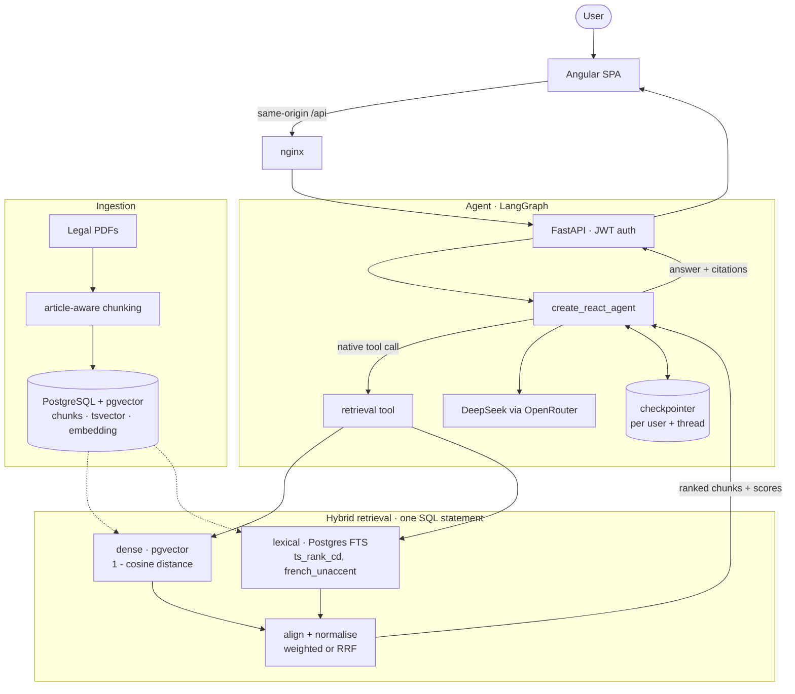

# 🇹🇳 Agent Juridique Tunisien

An AI-powered legal assistant designed to answer questions based on Tunisian law (Constitution and Penal Code) using a RAG (Retrieval-Augmented Generation) pipeline and an Agentic workflow.

## 📊 Pipeline & Workflow

The system follows a **Retrieval-Augmented Generation (RAG)** approach combined with a **ReAct (Reason + Act)** agent.



> The lexical arm is **Postgres full-text search, not an in-memory BM25 index** — that is
> what makes it durable, shared across replicas, and consistent with writes. And the
> shipped default is `HYBRID_WEIGHT_BM25=0.0` (dense only), because on this corpus every
> weighted hybrid measured *worse*: hit@5 0.839 dense vs 0.750 RRF vs 0.732 best weighted.
> The lexical arm stays in the code and in the ablation so the result can be re-measured,
> not assumed. See [eval/](eval/).

## 🚀 Running it

### Prerequisites

- Docker and Docker Compose.
- A valid `OPENROUTER_API_KEY` in `.env` (copy `.env.example`). If the key is revoked the
  API returns `OPENROUTER_API_KEY invalide ou révoquée.` rather than an answer.

### Everything at once

```bash
docker compose up --build
```

This starts Postgres+pgvector, runs the migrations, ingests the corpus, starts the API, and
serves the Angular UI behind nginx.

| | URL |
|---|---|
| **Application** | http://localhost:4200 |
| API (direct) | http://localhost:8000/api |
| OpenAPI docs | http://localhost:8000/docs |

nginx proxies `/api` to the backend, so **the browser only ever talks to one origin** —
there is no CORS configuration in the request path at all.

### Frontend development

```bash
python -m app.run          # the API on :8000
cd web && npm ci && npm start   # the UI on :4200, proxying /api to :8000
```

`web/proxy.conf.json` reproduces nginx's routing in the dev server, so development and
production have the same origin model rather than diverging.

New to Angular? **[docs/angular-primer.md](docs/angular-primer.md)** explains the framework
against this codebase specifically — signals via `AuthStore`, DI as the equivalent of
FastAPI's `Depends()`, and why a zoneless app must keep all rendered state in signals.

## 📂 Project Structure

- `app/` — FastAPI service: `api/` (routes, schemas), `domain/` (pure logic, no I/O),
  `infra/` (Postgres, embeddings), `agent/` (LangGraph), `services/`.
- `web/` — Angular 22 SPA (Material 3, standalone components, signals), served by nginx.
- `eval/` — golden set, retrieval metrics, and the ablation that gates CI.
- `alembic/` — migrations. `documents/` — the corpus PDFs.

## 🛠️ Technologies

- **Backend**: FastAPI, SQLAlchemy (async), LangGraph, Alembic
- **Frontend**: Angular 22, Angular Material 3, RxJS, Vitest
- **LLM**: DeepSeek (via OpenRouter)
- **Embeddings**: `intfloat/multilingual-e5-small` (SentenceTransformers)
- **Storage & search**: PostgreSQL + pgvector, Postgres FTS (`ts_rank_cd`) for the lexical arm
- **Auth**: argon2id + PyJWT, refresh-token rotation with replay detection
